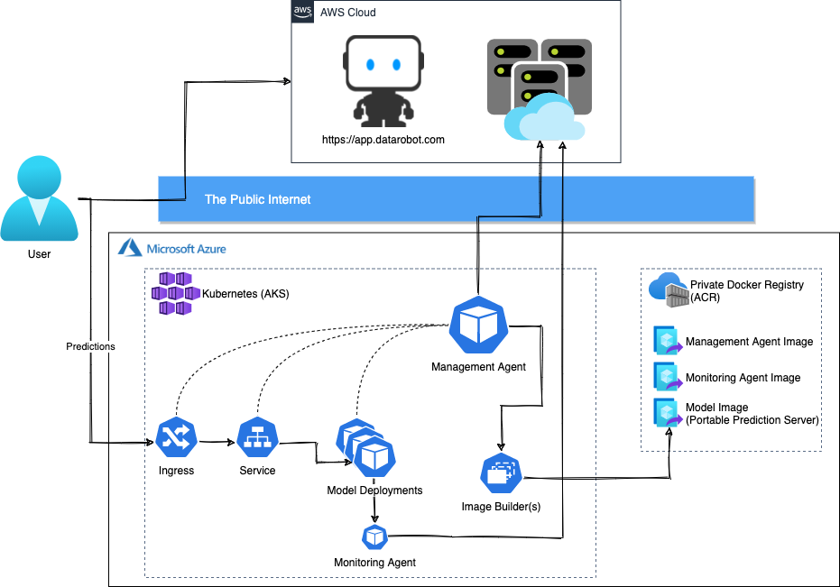
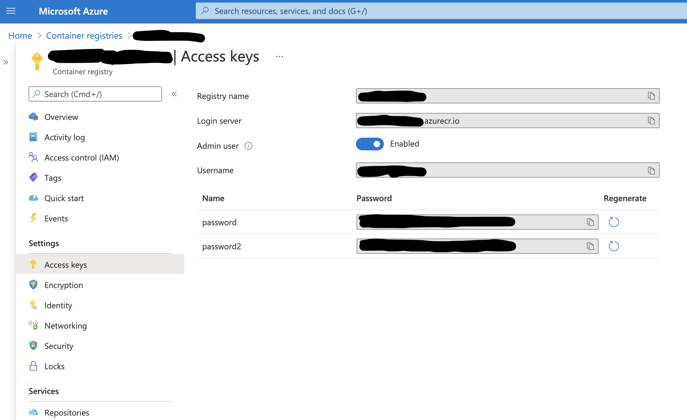
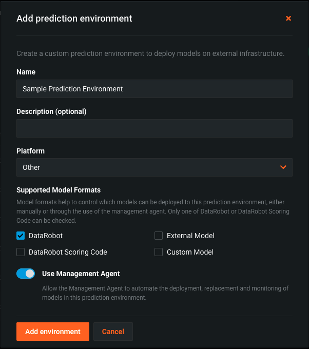
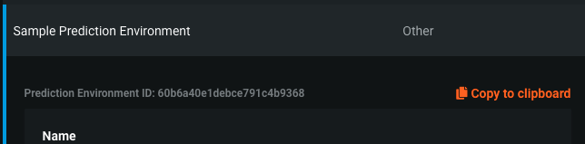
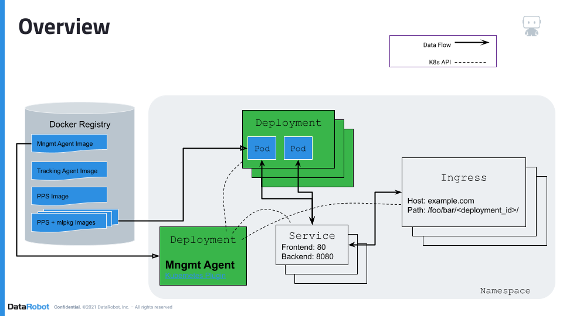
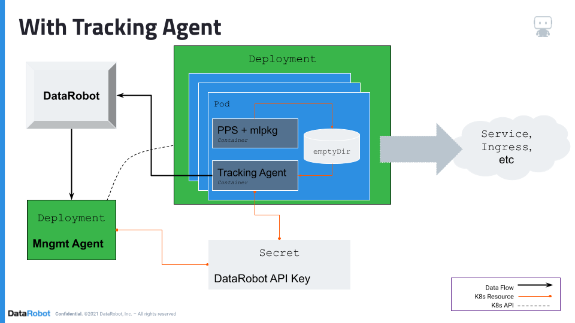
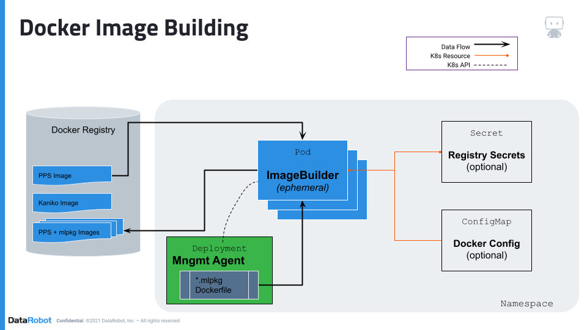

# DataRobot MLOps Management-Agent Helm chart for Kubernetes

This directory contains a chart to aid in the installation and configuration of Bosun and the built-in Kubernetes plugin. The plugin
and this chart should be considered **alpha** quality so please work with your account representative.

You'll need to build and push the Bosun docker image to a registry accessible by your k8s cluster. See the instructions in the parent
directory for more information.

Software Requirements:

- Kubernetes clusters of versions between v1.16 - v1.21
- Nginx-ingress
- A docker registry that our service can **push** images to

Minimum Hardware Requirements:

- 2+ CPU
- 40+ GB instance storage (image cache)
- 6+ GB memory

---

## Table of Contents
<!-- START doctoc generated TOC please keep comment here to allow auto update -->
<!-- DON'T EDIT THIS SECTION, INSTEAD RE-RUN doctoc TO UPDATE -->

- [Architecture](#architecture)
- [Configuring Registry Credentials](#configuring-registry-credentials)
  - [AWS](#aws)
  - [Azure](#azure)
  - [GCP](#gcp)
  - [Generic Registry (or Docker Hub)](#generic-registry-or-docker-hub)
- [Installing Management Agent (via Helm)](#installing-management-agent-via-helm)
  - [Fetching Portable Prediction Server Image](#fetching-portable-prediction-server-image)
  - [Building Required Docker Images](#building-required-docker-images)
  - [Create a new Prediction Environment](#create-a-new-prediction-environment)
  - [Installing the Helm Chart](#installing-the-helm-chart)
- [Detailed Architecture Diagrams](#detailed-architecture-diagrams)

<!-- END doctoc generated TOC please keep comment here to allow auto update -->

---

## Prerequisites

This section will explain how to setup all the required software requirements listed above. You can skip this section if you already have all the necessary prerequisites installed.

<details>
  <summary>Click for instructions on installing prerequisites...</summary>

### Kubernetes

Any Kubernetes cluster running a version between 1.16 to 1.21 should be supported so we recommend following the documentation of your distribution of choice to create a new cluster.

### Nginx Ingress

Currently, the only ingress controller we officially support is the open-source [Nginx-Ingress](https://kubernetes.github.io/ingress-nginx/) controller. We recommend consulting their documentation on how to install it in your environment but for example you could run:

```sh
# Create a namespace for your ingress resources
kubectl create namespace ingress-mlops

# Add the ingress-nginx repository
helm repo add ingress-nginx https://kubernetes.github.io/ingress-nginx
helm repo update

# Use Helm to deploy an NGINX ingress controller
helm install nginx-ingress ingress-nginx/ingress-nginx \
    --namespace ingress-mlops \
    --set controller.ingressClass=mlops \
    --set controller.autoscaling.enabled=true \
    --set controller.autoscaling.minReplicas=2
```

### Docker Registry

We support the major cloud vendor's managed registries (ECR, ACR, GCR) in addition to Docker Hub or any standard V2 docker registry. If you registry requires repos to be pre-created (i.e. ECR) you should create the following repos:

- datarobot/mlops-management-agent
- datarobot/mlops-tracking-agent
- datarobot/datarobot-portable-prediction-api
- mlops/frozen-models

**Important:** you will need to provide the management agent **push** access to the `mlops/frozen-model` repo. Examples for some common registry types are provided [below](#configuring-registry-credentials).

</details>

---

## Architecture



For more detailed diagrams, see the [appendix](#detailed-architecture-diagrams).

---

## Configuring Registry Credentials

### AWS

<details>
  <summary>Click for ECR details...</summary>

For ECR, the first think you need to do is make sure all the required repos are created. You can do it via the UI or from the CLI like so:

```sh
repos="datarobot/mlops-management-agent
datarobot/mlops-tracking-agent
datarobot/datarobot-portable-prediction-api
mlops/frozen-model"
for repo in $repos; do
  aws ecr create-repository --repository-name $repo
done
```

One way to provide push credentials to our agent is by using an [IAM role for the service account](https://docs.aws.amazon.com/eks/latest/userguide/iam-roles-for-service-accounts.html) we run under.

```sh
eksctl create iamserviceaccount --approve \
    --cluster <your-cluster-name> \
    --namespace datarobot-mlops \
    --name datarobot-management-agent-image-builder \
    --attach-policy-arn arn:aws:iam::aws:policy/AmazonEC2ContainerRegistryPowerUser
```

Create a file called `config.json` with the following contents:

```json
{ "credsStore": "ecr-login" }
```

Then create a ConfigMap from the file:

```sh
kubectl create configmap docker-config \
    --namespace datarobot-mlops \
    --from-file=<path to config.json>
```

Update the [values.yaml](./datarobot-management-agent/values.yaml) _imageBuilder_ section to use the new config you created and configure the service account with the IAM role you created:

```yaml
imageBuilder:
  configMap: "docker-config"
  serviceAccount:
    create: false
    name: "datarobot-management-agent-image-builder"
```

</details>

### Azure

<details>
  <summary>Click for ACR details...</summary>
Enable the `Admin user` for your ACR registry:


Use one of the generated passwords to create a new secret:

```sh
kubectl create secret docker-registry registry-creds \
    --namespace datarobot-mlops \
    --docker-server=<container-registry-name>.azurecr.io \
    --docker-username=<admin-username> \
    --docker-password=<admin-password>
```

Update the [values.yaml](./datarobot-management-agent/values.yaml) _imageBuilder_ section to use the new secret you created:

```yaml
imageBuilder:
  secretName: "registry-creds"
```

</details>

### GCP

<details>
  <summary>Click for GCR details...</summary>
We recommend the use of Workload Identity on your GKE cluster to provide GCR push credentials to our Docker image building service.

Learn more on how to [enable](https://cloud.google.com/kubernetes-engine/docs/how-to/workload-identity#enable_on_cluster) and [migrate existing node pools](https://cloud.google.com/kubernetes-engine/docs/how-to/workload-identity#migrate_applications_to) to workload identity.

Detailed steps on how to setup authentication can be found [here](https://cloud.google.com/kubernetes-engine/docs/how-to/workload-identity#authenticating_to) but below you can find the minimal set of instructions to complete this guide.

Make sure you have enabled Workload Identity on your cluster and **all** of your node groups, for example:

```sh
# Enable workload identity on your existing cluster
gcloud container clusters update <CLUSTER-NAME> \
  --workload-pool=<PROJECT-NAME>.svc.id.goog

# Enable workload identity on an existing node pool
gcloud container node-pools update <NODE-POOL-NAME> \     
  --cluster=<CLUSTER-NAME> \                                               
  --workload-metadata=GKE_METADATA
```

After the cluster is ready, we can create a new IAM service account, attach a role that provides all the necessary permissions to our image-builder service to push new images into GCR and finally bind it to the GKE ServiceAccount that will get created upon install:

```sh
# Create Service Account
gcloud iam service-accounts create gcr-push-user

# Give user push access to GCR
gcloud projects add-iam-policy-binding <PROJECT-NAME> \
  --member=serviceAccount:[gcr-push-user]@<PROJECT-NAME>.iam.gserviceaccount.com \
  --role=roles/cloudbuild.builds.builder

# Link GKE ServiceAccount with the IAM Service Account
gcloud iam service-accounts add-iam-policy-binding \   
  --role roles/iam.workloadIdentityUser \
  --member "serviceAccount:<PROJECT-NAME>.svc.id.goog[datarobot-mlops/datarobot-management-agent-image-builder]" \
  gcr-push-user@<PROJECT-NAME>.iam.gserviceaccount.com
```

Finally, update the [values.yaml](./datarobot-management-agent/values.yaml) _imageBuilder_ section to create the ServiceAccount
with the correct annotation and name that we setup from the steps above:

```yaml
imageBuilder:
  serviceAccount:
    create: true
    annotations: {
      iam.gke.io/gcp-service-account: gcr-push-user@<PROJECT-NAME>.iam.gserviceaccount.com
    }
    name: datarobot-management-agent-image-builder
```

</details>

### Generic Registry (or Docker Hub)

<details>
  <summary>Click for generic docker registry details...</summary>
If you have a generic registry that uses a simple docker username/password to login, you can use the following procedure.

Create a secret containing your docker registry credentials:

```sh
kubectl create secret docker-registry registry-creds \
    --namespace datarobot-mlops \
    --docker-server=<container-registry-name>.your-company.com \
    --docker-username=<push-username> \
    --docker-password=<push-password>
```

Update the [values.yaml](./datarobot-management-agent/values.yaml) _imageBuilder_ section to use the new secret you created:

```yaml
imageBuilder:
  secretName: "registry-creds"
```

If your registry is running on HTTP you will need to add the following to the above example:

```yaml
imageBuilder:
  secretName: "registry-creds"
  insecureRegistries:
    - <container-registry-name>.your-company.com
```

</details>

---

## Installing Management Agent (via Helm)

Now that all the prerequisites are setup let us install the MLOps Management Agent. In these first steps, you will be building and pushing **rather large** docker images up to your remote registry so we recommend **running these steps in parallel** while downloads or uploads are happening.

### Fetching Portable Prediction Server Image

The first step is to download the latest version of the `Portable Prediction Server Docker Image` by browsing to <https://app.datarobot.com/account/developer-tools> (_adjust the URL accordingly for different SaaS clusters or Enterprise installs_). When the download is finished run the following:

1. `docker load < datarobot-portable-prediction-api-<VERSION>.tar.gz`
2. `docker tag datarobot/datarobot-portable-prediction-api:<VERSION> registry.your-company.com/datarobot/datarobot-portable-prediction-api:<VERSION>`
3. `docker push datarobot`

### Building Required Docker Images

_Note: these images don't depend on each other so they can be built in parallel._<br>

First, build the Management Agent image with a single command:

```sh
make -C tools/bosun_docker REGISTRY=registry.your-company.com push
```

_If you do not plan on enabling model monitoring, you can skip this build._<br>
Next, build the Monitoring Agent with a similar command:

```sh
make -C tools/agent_docker REGISTRY=registry.your-company.com push
```

### Create a new Prediction Environment

You can create a new prediction environment at <https://app.datarobot.com/deployments/prediction-environments> (update URL for Enterprise installs).



_Note: only the `DataRobot` model format is currently supported._



Record the Prediction Environment ID for later use.

### Installing the Helm Chart

**Note: if the images are still pushing, please wait for them to complete before proceeding.**

We recommend installing the agent into its own namespace so we will pre-create it and install our MLOps API key into it.

```sh
# Create a namespace to contain the agent and all the models it deploys
kubectl create namespace datarobot-mlops

# You can use an existing key or we recommend creating a key dedicated to the agent
# by browsing here:
#   https://app.datarobot.com/account/developer-tools
kubectl -n datarobot-mlops create secret generic mlops-api-key --from-literal=secret=<YOUR-API-TOKEN>
```

We have several common [examples](./datarobot-management-agent/examples/) for the various cloud environments that we recommend. After modifying one to adapt to your account, you can install our agent as follows:

```sh
helm upgrade --install bosun ./datarobot-management-agent \
    --namespace datarobot-mlops \
    --values ./datarobot-management-agent/examples/AWS_values.yaml
```

Or if none of the examples suite your needs, the **minimum** command to install the agent is as follows:

```sh
helm upgrade --install bosun ./datarobot-management-agent \
    --namespace datarobot-mlops \
    --set ingress.className=mlops \
    --set ingress.outfacingURLPrefix=http://your-company.com/deployments/ \
    --set datarobot.apiSecretName=mlops-api-key \
    --set datarobot.predictionEnvId=<PRED ENV ID> \
    --set bosun.repository=registry.your-company.com/datarobot/mlops-management-agent \
    --set tracking.image=registry.your-company.com/datarobot/mlops-tracking-agent:latest \
    --set imageBuilder.ppsImage=registry.your-company.com/datarobot/datarobot-portable-prediction-api:<VERSION> \
    --set imageBuilder.generatedImageRepository=registry.your-company.com/mlops/frozen-models
```

There are additional configurations that you may be interested in. You can look at the [values.yaml](./datarobot-management-agent/values.yaml) file or run the command below

```sh
helm show values ./datarobot-management-agent
```

---

## Detailed Architecture Diagrams



The diagram above shows a slightly more detailed diagram of the system architecture.



The diagram above shows a zoomed in look at how we deploy your models into Kubernetes and enable model monitoring.



The diagram above shows the specifics of how we package the models from DataRobot into a deployable image for Kubernetes to run. We are leveraging an open source tool maintained by Google called [Kaniko](https://github.com/GoogleContainerTools/kaniko). It was specifically designed to build Docker images inside of a Kubernetes cluster in a secure manner.
